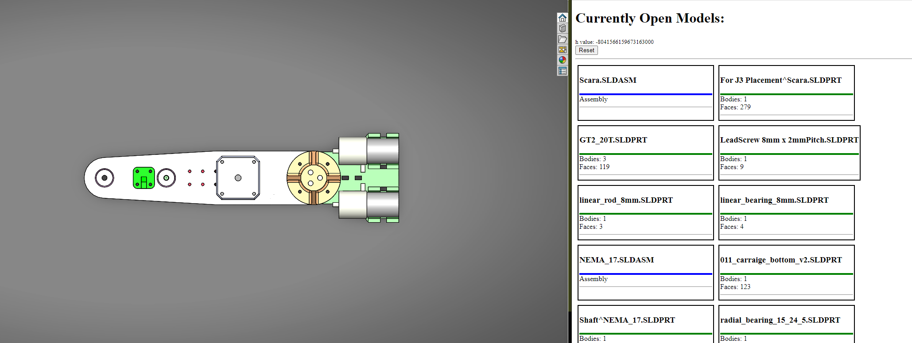
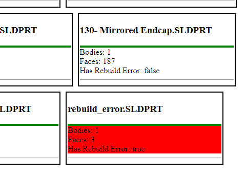

# Webapp

A proof of concept for communicating between SolidWorks, a database, and a web browser.

That is, a proof that you can break out of the SolidWorks/C# sandbox and connect into the broader world of Python. This project demonstrates three key functionalities:

* Exporting Data from SolidWorks to a Database in near real time
* Rendering that data to a Web Browser (via React)
* Doing the above without (significantly) impacting the experience of using SolidWorks

Simply the ability to export SolidWorks data to the Database unlocks a massive potential for further integration of SolidWorks with additional features. 

## Tech Stack

* PythonCOM - calls Windows COM from python
* SolidProxy - this library, the thing we are demonstrating functionality for.
* Django - python framework for backend WebApp stuff. Automates most of database interfacing, updating, etc based on a user defined Python Class
  * Django REST - extension for implementing RESTful APIs
* React - javascript framework for rendering dynamic HTML pages. Developed by Facebook (now Meta).

> The Django-React decision was motivated solely by the fact that I had some prior experience and also want to use this frontend-backend model in a couple other projects.

## Architecture

There are roughly two parts. Both are polling based simply because it was easier to write. The middle ground is the Django Database (sqlite), which stores models and some associated information. 

When Django starts, it launches a thread to connect with SolidWorks and poll for documents (this should be a callback; SolidWorks supports this but I have not yet gotten it to work with Python). When files are opened (or closed), an entry is created (or removed) in the database. Then a task is created to load any relevant secondary information into the database. This has the effect of making the process responsive, even when there may be several parts of the database to load details for over many seconds.

The React Frontend communicates via a RESTful model to Django (and by extension the database). This is done in another polling model: every time period (second), the app requests an hash of the database and compares it to the previous hash. If there is a change, the app requests the _entire_ database of parts and re-renders the _entire_ webpage. Again, this is not the most efficient, but it was extremely simple to write.

At the moment, the app displays Parts and Assemblies in a tiles style. There is a color coded bar based on type. For parts, it shows the number of bodies, number of faces, and if the part has any rebuild errors.

> As written, these fields are only calculate when the file is opened. It would be trivial to place the property calculation into a loop. Thanks to he hash calculation, any changes will eventually populate to the frontend. However, this is another instance where a callback for document updates should be significantly better.

A diagram of the data flow follows:

```mermaid

stateDiagram-v2
    direction LR

    state Windows {
        direction TB

        WindowsCOM --> SolidWorksCOM
        PythonCOM --> WindowsCOM
        WindowsCOM --> PythonCOM
        PythonCOM --> SolidProxy
        SolidProxy --> PythonCOM
        
        
        state SolidWorksApp {
            GUI
            SolidWorksCOM --> WindowsCOM
        }

        state Python {
            PythonCOM


            state SolidProxy {
                IModelDoc2 --> SWModel
                SWModel --> IModelDoc2
                ISldWorks
            }

            state Django {
                SWModel --> Database
                Database --> SWModel
                Database --> REST : JSON
                Routing --> Database
            }
        }

        WindowsCOM
    }

    state WebBrowser {
        REST --> REACT
        REACT --> REST
        REST --> Routing : HTTP
    }

    state Windows {
        state Python {
            state Django {
                Routing
            }
        }
    }

    UserIO --> WebBrowser
    WebBrowser --> UserIO
    UserIO --> GUI
    GUI --> UserIO
```

And two images showing SolidWorks model and the corresponding files in the Web Browser. The other shows different rendering options based on rebuild status.

## Qualitative

This is really cool. And it works extremely well. Its responsive and the impact when using SolidWorks seems minimal. Definitely has major potential and there are many many possible scenarios of interest:

* Export models to `stl` or `dxf` for manufacturing (possibly automatically based on geometry).
  * Can these then be imported into something like `Octoprint` for slicing and printing immediately.
  * Even just populate the print time and material usage from the slicer in real time.
* Highlight `first focus`: things that need to be fixed or are bad.
* Track when something started failing.
* Rapid Selections: click a button in the web app and add it to the selection group in SolidWorks. For example, in the outer most assembly, have buttons for quickly selecting planes (and other reference geometry) without needing to use the feature manager in SolidWorks
* Live Updating 3-View representation of the active document on a second monitor.
* Displaying a part's feature tree as a proper tree (using some graph rendering library).

## Resources

Tutorial for configuring django-react ([Link](https://dev.to/nagatodev/how-to-connect-django-to-reactjs-1a71)). This tutorial helped setup the structure for Django-React hierarchy. 

To develop you probably want to run both the django app and the react frontend:

* from `ex_backend/`: `python manage.py runserver`
* from `ex_backend/frontend/`: `npm run start`

> You do not _need_ to run `npm build` to see changes. If you run both servers; direct the browser at the port for the npm server and it should redirect the api requests to django automatically. Both dev-servers update automatically when the relevant files are updated. This makes editing a significantly more enjoyable experience.

